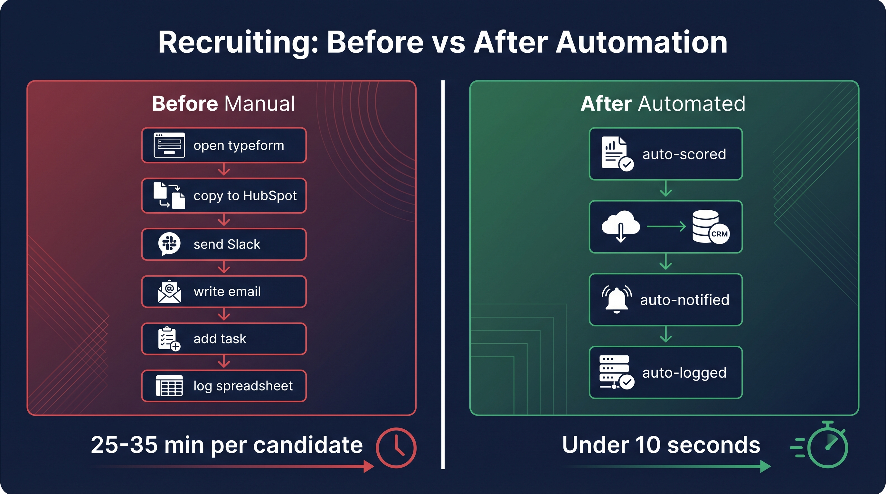
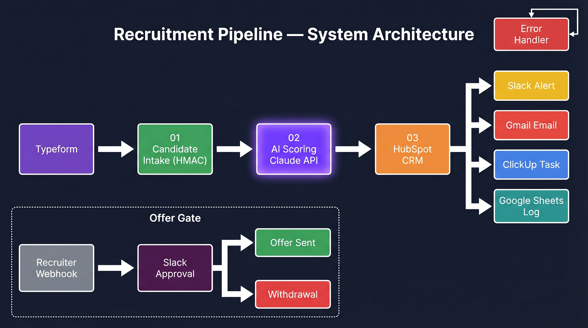
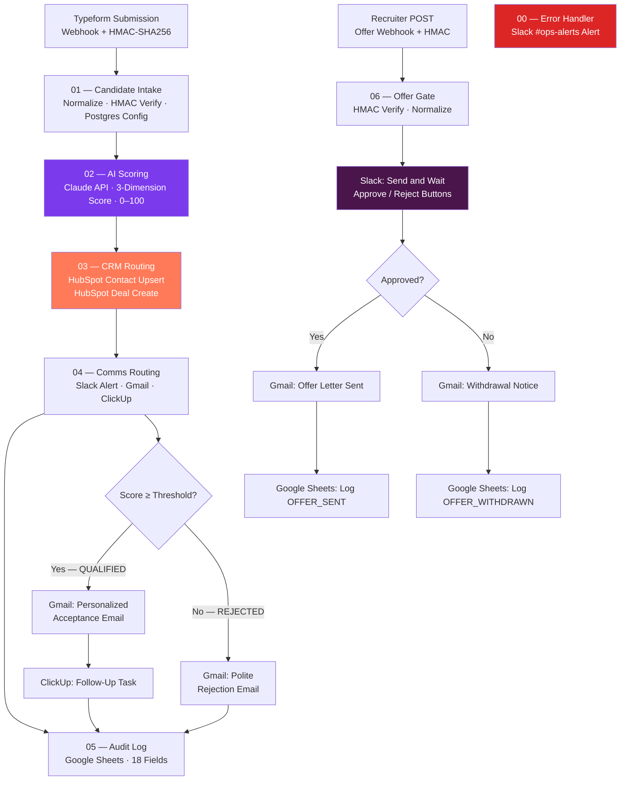

# Recruitment-to-Onboarding Pipeline

> A candidate submits a form. In under 10 seconds — with zero human input — they are scored by AI, added to your CRM, alerted to your team on Slack, sent a personalized email response, assigned a follow-up task, and logged to an audit spreadsheet. Every time. No exceptions.

---

## At a Glance

| | |
|---|---|
| **Trigger** | Typeform form submission |
| **Systems automated** | Typeform · Claude AI · HubSpot · Slack · Gmail · ClickUp · Google Sheets |
| **End-to-end time** | Under 10 seconds per candidate |
| **Manual data entry** | Zero |
| **AI cost per candidate** | ~$0.001 |
| **Recruiter hours saved** | ~8 hours/month at 100 candidates |
| **Offer emails auto-sent** | Never — human approval required every time |

---

## For Non-Technical Readers — What This Does

You are probably spending hours every week copying candidate information from one tool to another. This pipeline eliminates that entirely.

**Here is exactly what happens when a candidate submits your application form:**

1. Their information is instantly verified and securely received
2. An AI (Claude) reads their application and scores them on three dimensions: how well they fit the role, how strong their experience is, and how clearly they write
3. Your HubSpot CRM is automatically updated — no duplicate contacts, ever
4. Your team gets a Slack message with the candidate's name, score, and a summary
5. The candidate receives a personalized email — an acceptance message if they scored well, a polite rejection if they did not
6. If they qualified, a follow-up task is created in ClickUp for your recruiter
7. Every candidate is logged to a Google Sheets audit trail automatically

**When you are ready to make an offer:**
You send a single request. The system posts the full offer details to Slack and waits. A human must click "Approve" before any offer email goes out. No offer is ever sent automatically — this is intentional and non-negotiable.

---

## Before and After



---

## Business Impact

| Before | After |
|---|---|
| Recruiter manually copies candidate data from Typeform to HubSpot | AI scores candidate in ~2 seconds, CRM updated automatically |
| Score decision made by reading each application manually | Weighted composite score across 3 dimensions: role fit, experience, response quality |
| Candidate notified after recruiter remembers to send email | Personalized acceptance or rejection email sent within seconds of submission |
| Follow-up task added to ClickUp if recruiter remembers | ClickUp task auto-created for every qualified candidate |
| Audit trail lives in recruiter's memory or ad-hoc spreadsheet | Every candidate appended to structured Google Sheets log automatically |
| Offer email manually drafted and sent, no approval trail | Offer requires explicit Slack approval — never auto-sent |
| Time from submission to first response: hours to days | Time from submission to scored, notified, CRM-created: **under 10 seconds** |

**Estimated savings at 100 candidates/month:** ~8 hours of recruiter admin time, zero missed follow-ups, zero duplicate HubSpot contacts.

---

## The Problem

HR and recruiting teams are buried in copy-paste work. A candidate submits a Typeform. The recruiter:

1. Opens Typeform to read the response
2. Opens HubSpot to check if the candidate exists, create or update a contact, and create a deal
3. Sends a Slack message to let the team know
4. Writes a personalized email response — different if qualified vs rejected
5. Adds a ClickUp task if they want to follow up
6. Logs the candidate to a tracking spreadsheet
7. Weeks later: drafts an offer email, sends it manually, hopes they documented the decision

Every one of those steps is manual, error-prone, and does not scale. This pipeline automates all of it.

---

## System Architecture





---

## Workflow Structure

| File | Trigger | Purpose | Systems Touched |
|---|---|---|---|
| `00-error-handler.json` | Error Trigger | Catches failures across all 6 workflows; sends structured Slack alert with node name, error message, candidate context | Slack |
| `01-candidate-intake.json` | Typeform Webhook | Verifies HMAC signature, normalizes candidate fields, loads per-client config from Postgres, enforces idempotency | Typeform, Postgres/Supabase |
| `02-ai-scoring.json` | Sub-workflow | Builds Claude prompt from client template, calls Anthropic API, parses 3-dimension score, computes weighted composite | Anthropic Claude API |
| `03-crm-routing.json` | Sub-workflow | Upserts HubSpot contact (dedup by email), creates associated deal with AI score properties | HubSpot |
| `04-comms-routing.json` | Sub-workflow | Sends Slack alert card, routes to acceptance or rejection Gmail based on score, creates ClickUp follow-up task for qualified candidates | Slack, Gmail, ClickUp |
| `05-audit-log.json` | Sub-workflow | Appends single row to Google Sheets covering all 18 pipeline fields | Google Sheets |
| `06-offer-gate.json` | Manual Webhook | HMAC-secured standalone webhook; sends Slack approval request; conditional Gmail offer or withdrawal on recruiter decision | Slack (Send and Wait), Gmail, Google Sheets |

---

## AI Scoring Model

Claude scores each candidate across three dimensions using a weighted composite:

| Dimension | Weight | What it measures |
|---|---|---|
| `role_fit` | 40% | How well the candidate's background matches the specific role requirements |
| `experience_signals` | 35% | Depth and relevance of prior experience; career progression signals |
| `response_quality` | 25% | Clarity, professionalism, and thoughtfulness of the cover note |

**Composite formula:** `(role_fit × 0.40) + (experience_signals × 0.35) + (response_quality × 0.25)`

**Threshold:** Configurable per client in Postgres (default: 60/100). Candidates scoring ≥ threshold are `QUALIFIED`; below threshold are `REJECTED`.

**Model used:** `claude-haiku-4-5-20251001` — fast and cost-effective for high-volume scoring (~$0.001 per candidate at typical input lengths).

The scoring prompt is templated per client. Clients can customize system instructions while the 3-dimension rubric and JSON output format remain fixed, ensuring consistent downstream processing regardless of client-specific context.

---

## Score Thresholds

| Score | Disposition | Actions |
|---|---|---|
| ≥ threshold (default 60) | QUALIFIED | Slack alert + acceptance Gmail + ClickUp follow-up task + Sheets log |
| < threshold | REJECTED | Slack alert + rejection Gmail + Sheets log (no ClickUp task) |

The threshold calibration at 60 reflects a default hiring bar: candidates with moderate role fit, some relevant experience, and a coherent cover note. Clients with higher-volume hiring typically lower this; specialized roles typically raise it. The threshold is a single SQL UPDATE — no workflow edit required.

---

## Security Architecture

| Layer | Implementation |
|---|---|
| Typeform webhook auth | HMAC-SHA256 on raw request body (`X-Typeform-Signature` header) — timing-safe comparison |
| Offer gate webhook auth | HMAC-SHA256 on raw request body (`x-offer-signature` header) — timing-safe comparison |
| Replay protection | Mandatory `requestedAt` timestamp in offer payload; requests older than 5 minutes are rejected |
| API credentials | Stored in n8n encrypted credential store — never in workflow JSON |
| Secrets | Read from n8n environment variables (`$env['SECRET']`) — never hardcoded in Code nodes |
| Sub-workflow access | `callerPolicy: workflowsFromSameOwner` — rejects cross-account calls on all sub-workflows |
| Execution data | `saveDataSuccessExecution: none` — PII not persisted on successful runs |
| Google Sheets writes | `valueInputMode: RAW` — prevents formula injection via candidate-supplied data |
| Candidate free-text | `sanitize()` strips `{{ }}` patterns before AI processing — prevents n8n expression injection |
| Prompt injection defense | Candidate cover note wrapped in `---BEGIN/END CANDIDATE NOTE---` delimiters with system prompt directive to treat content as plain text only |
| HubSpot access scope | Minimal: contacts + deals read/write only; no other HubSpot object access |
| Claude API | HTTP Header Auth credential; key scoped to Anthropic account |
| Offer approvals | Human gate enforced at workflow level via Slack Send and Wait — not a UI checkbox |

---

## Engineering Decisions

### Why HubSpot dedup BEFORE contact creation

The Contact Upsert node uses HubSpot's native create-or-update by email. If a candidate reapplies, their AI scores are updated on the existing contact rather than creating a duplicate. Without this, HubSpot fills with duplicate contacts and every dashboard metric is wrong.

### Why score threshold is configurable in Postgres, not hardcoded

Different clients have different hiring bars. A startup filling a junior role may accept scores above 45; an enterprise hiring a senior engineer may require 75. The pipeline loads the threshold from a Postgres config row per client_id at intake time. Recruiters change it with a SQL UPDATE — no workflow edit required.

### Why the offer gate is standalone, not part of the automated chain

The automated pipeline (01–05) is fast and stateless — it runs in seconds and never waits for human input. The offer gate is fundamentally different: it suspends execution until a human approves. Mixing a human-in-the-loop gate into the automated chain would cause the parent execution to hang indefinitely, consuming n8n execution resources and creating timeout risk. Keeping it standalone means each concern is architecturally clean.

### Why offers NEVER auto-send

Offer emails are legally significant documents. An auto-sent offer at the wrong compensation or to the wrong candidate is an HR and legal incident. The Slack "Send and Wait for Response" node with `responseType: "approval"` creates a mandatory human gate: the recruiter sees the full offer details, clicks Approve or Reject in Slack, and the email sends only if approved. No offer escapes this gate.

### Why the dual-terminal pattern in Comms Routing

The IF node in `04-comms-routing` splits into two branches. Both branches eventually call the Audit Log sub-workflow. Since sub-workflow execution in n8n requires a single item input, both terminal Code nodes (QUALIFIED Output / REJECTED Output) normalize the payload and connect to one Audit Log node. Only one branch fires per execution, so the audit log always receives exactly one item — no Merge node needed.

### Why `rawBody: true` on the offer gate webhook

HMAC verification requires the exact byte representation of the request body. n8n's webhook node normally parses JSON bodies before they reach workflow nodes — meaning the computed HMAC would differ from the sender's (JSON is re-serialized with potentially different key ordering or whitespace). `rawBody: true` gives the Code node the original raw string, ensuring byte-for-byte HMAC accuracy.

### Why Supabase via direct Postgres connection, not the Supabase n8n node

The Supabase n8n node only supports row-level CRUD operations — no raw SQL, no joins. Loading client config requires a join across `clients`, `scoring_prompts`, and `email_templates` filtered by `WHERE c.slug = $1`. The native Postgres node with a direct Supabase connection string supports full SQL with parameterized queries and is a single credential. Zero workarounds.

### Why `$execution.customData` is set at every stage

The master error workflow (`00-error-handler`) receives the execution ID but limited payload context — by default it only knows which workflow failed, not which candidate was being processed. By calling `$execution.customData.set('candidate_name', ...)` at every stage, the error handler Slack alert includes the candidate name alongside the failed node name and error message — giving ops teams enough context to identify who was affected and manually recover without digging through execution logs.

---

## Data Flow — All 18 Audit Fields

Every candidate execution writes one row to the Google Sheets audit log:

| Column | Source |
|---|---|
| candidate_name | Typeform: full_name |
| candidate_email | Typeform: email |
| client_name | Postgres: clients.name |
| role_applied | Typeform: role |
| composite_score | Claude scoring: weighted formula |
| disposition | Computed: QUALIFIED or REJECTED |
| overall_signal | Claude scoring: STRONG / MODERATE / WEAK |
| role_fit_score | Claude scoring: role_fit dimension |
| experience_score | Claude scoring: experience_signals dimension |
| response_qual_score | Claude scoring: response_quality dimension |
| hubspot_contact_id | HubSpot: contact upsert response |
| hubspot_deal_id | HubSpot: deal create response |
| slack_notified | Boolean: always true after Batch 5 |
| gmail_sent | Boolean: always true after Batch 5 |
| email_type | Literal: 'success' or 'rejection' |
| clickup_task_created | Boolean: true only for QUALIFIED path |
| scored_at | ISO timestamp from Batch 3 |
| comms_completed_at | ISO timestamp from Batch 5 |

---

## Tech Stack

| Layer | Technology | Why |
|---|---|---|
| Automation platform | n8n Cloud | 1,200+ native integrations; sub-workflow chaining; Send and Wait for human gates |
| AI scoring | Anthropic Claude (Haiku 4.5) | Fast, affordable, structured JSON output for scoring |
| CRM | HubSpot | Industry-standard for recruiting; dedup by email native; custom properties |
| Messaging | Slack | Real-time ops alerts + human approval gate via interactive messages |
| Email | Gmail | OAuth2; simple API; same credential for notifications and offer letters |
| Task management | ClickUp | Flexible hierarchy; API supports full task creation with description/priority |
| Audit log | Google Sheets | Human-readable; non-technical stakeholders can filter/sort candidates |
| Config store | Postgres (Supabase) | Multi-client config; SQL queries; no ORM overhead |
| Offer gate auth | HMAC-SHA256 | Standard webhook security; no OAuth dependency for recruiter tools |

---

## Production Metrics

Estimated at 100 candidates/month:

| Metric | Value |
|---|---|
| Pipeline execution time | < 10 seconds per candidate |
| Claude API cost | ~$0.001/candidate (Haiku 4.5 input/output tokens) |
| n8n Cloud executions | ~600/month (100 candidates × 6 sub-workflow hops) |
| Recruiter admin time saved | ~8 hours/month (5 min manual → 0 min automated per candidate) |
| HubSpot duplicate contacts | 0 (dedup by email enforced before every contact write) |
| Missed follow-up tasks | 0 (auto-created for every qualified candidate) |

---

## Who Uses This

**Recruiting agencies** running high-volume candidate pipelines across multiple clients — each client gets their own scoring threshold and email templates from Postgres.

**HR teams at SaaS companies** that already use HubSpot + Slack + ClickUp and want automated candidate tracking without a dedicated ATS.

**Staffing firms** that need a structured audit trail (Google Sheets) and approval documentation for offer decisions.

**Operations-first teams** that want Slack as their coordination layer — every candidate alert, follow-up task, and offer approval happens in Slack without switching tools.

---

## Lessons Learned

**1. n8n sub-workflow chain requires reverse activation order.** The child must be active before the parent calls it, or the Execute Workflow node fails at runtime. Activating from the bottom of the chain up (05 → 04 → 03 → 02 → 01) is the only safe order.

**2. `rawBody: true` and JSON parsing order matter for HMAC.** HMAC must be computed on the original raw string, not on a re-serialized JSON object. Parse `JSON.parse(rawBody)` only after verification passes, never before.

**3. n8n expression validator false-positives on Google Sheets `defineBelow` column values.** The validator suggests wrapping plain expression strings in `__rl` resource locator format. This is incorrect for `mappingMode: "defineBelow"` — only `documentId` and `sheetName` use resource locators. Column value mappings are plain strings. Confirmed through validator confidence level (50%) and runtime testing.

**4. Dual-terminal pattern avoids Merge node complexity.** When two IF branches both need to call the same downstream sub-workflow, connecting both terminal nodes to one Execute Workflow node works cleanly — n8n routes whichever single item arrives. No Merge node, no timing issues, no double-fire risk (because the IF is exclusive).

**5. `$execution.customData` is the error handler's only window into candidate context.** Without it, a failure in Batch 4 produces a Slack alert that says "workflow failed" with no candidate context. With it, the alert includes the candidate's name alongside the failed node name and error message — enough for ops teams to identify which candidate was affected and manually recover without digging through execution logs.

---

## Setup

See [SETUP.md](./SETUP.md) for step-by-step credential configuration, Google Sheets schema, Supabase table setup, Typeform field names, and activation order.

See [replacements.txt](./replacements.txt) for the complete placeholder-to-value mapping reference.

---

## Repository Structure

```
recruitment-pipeline/
├── .gitignore                 Credentials excluded; workflows/ NOT excluded (JSON is safe)
├── README.md                  This file
├── SETUP.md                   Step-by-step: credentials, schemas, activation order, testing
├── replacements.txt           [PLACEHOLDER] → production value mapping
├── docs/
│   ├── architecture.jpg       System architecture diagram
│   └── before-after.jpg       Before/after automation comparison
└── workflows/
    ├── 00-error-handler.json  Error Trigger → Slack structured alert
    ├── 01-candidate-intake.json  Typeform → HMAC → normalize → Postgres config
    ├── 02-ai-scoring.json     Claude API → 3-dimension score → composite
    ├── 03-crm-routing.json    HubSpot contact upsert → deal create
    ├── 04-comms-routing.json  Slack alert → Gmail (score-gated) → ClickUp
    ├── 05-audit-log.json      Google Sheets append (all paths)
    └── 06-offer-gate.json     Manual webhook → Slack approval → Gmail conditional
```
